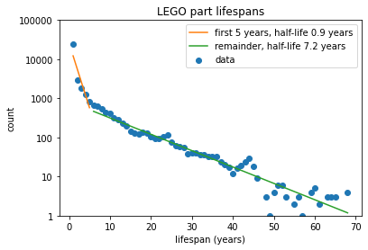

# reuse-metaphor
Analyses of LEGO product data as a metaphor for reuse in software. Written up in a series of posts at https://safetydave.net

## contents

* [lifespans](lego_lifespans.ipynb) - analysis of LEGO part lifespans.
* [parts sets time](lego_parts_sets_time.ipynb) - analysis of part inclusions in sets.
* [part sets heroes](lego_parts_sets_heroes.ipynb) - parts playing differentiating roles in sets.
* [recommendations](lego_recommendations.ipynb) - exploring recommendation techniques.
* [parts sets graph](lego_parts_sets_graph.ipynb) - modelling parts and sets connections as a graph.
